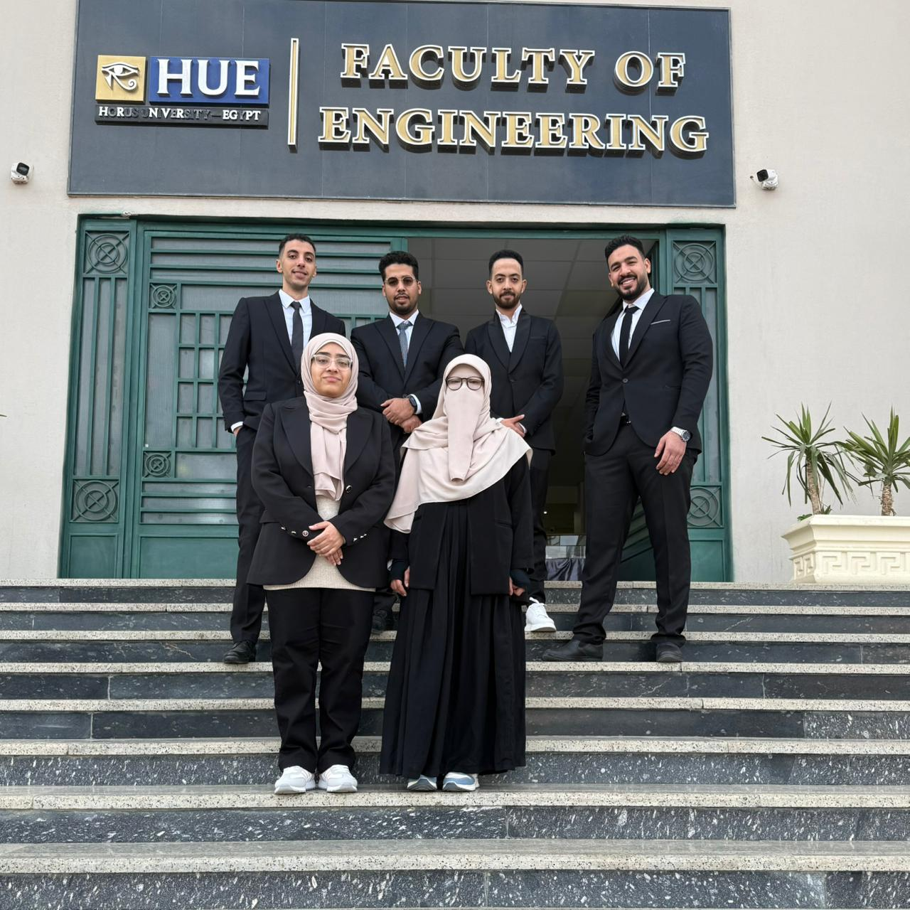
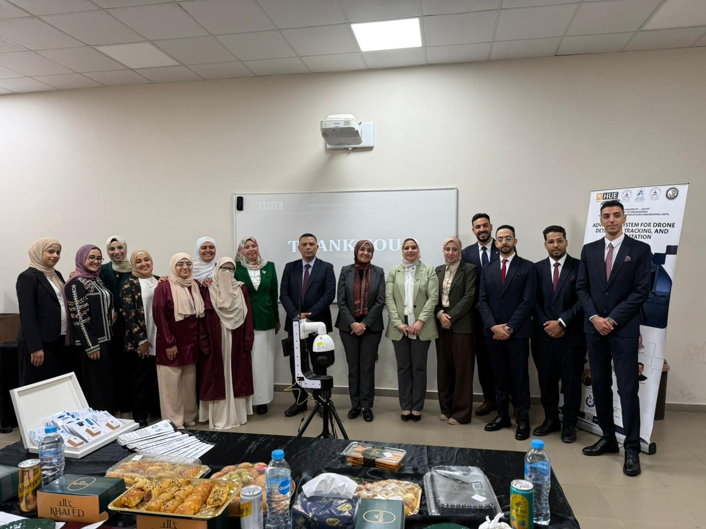
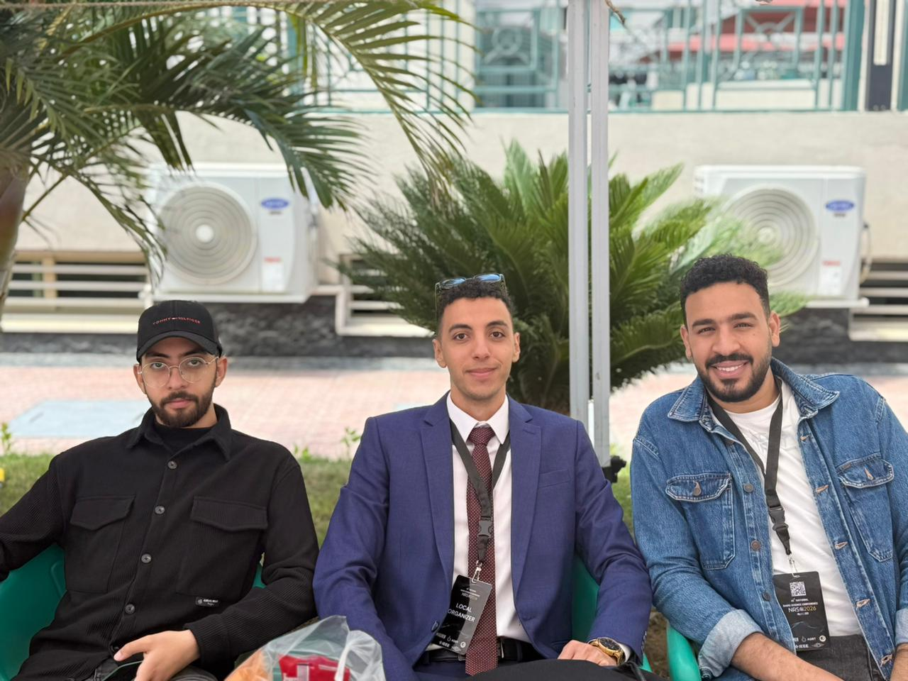

<div align="center">


# Advanced System for Drone Detection, Tracking & Neutralization

### Bridging the Granularity Gap between conventional radar and autonomous micro-UAVs

**Graduation Project 2026 · Faculty of Engineering · Dept. of Communications & Electronics Engineering**
**Horus University Egypt**


[](https://huje.journals.ekb.eg/article_508720.html)


[**Live Site**](https://islam-8.github.io/cuas/) · [**Read the Paper**](https://huje.journals.ekb.eg/article_508720.html) · [**Watch the Demo**](assets/components/Video.mp4) · [**Portfolio**](https://islam-8.github.io/portfolio/)

</div>

---

## Table of Contents
- [About](#about)
- [Key Results](#key-results)
- [System Architecture](#system-architecture)
- [Hardware](#hardware)
- [Website Stack](#website-stack)
- [Project Structure](#project-structure)
- [Getting Started](#getting-started)
- [Gallery & Field Documentation](#gallery--field-documentation)
- [Team](#team)
- [Publications & Recognition](#publications--recognition)
- [Funding & Institutional Support](#funding--institutional-support)
- [Roadmap](#roadmap)
- [Contact](#contact)
- [License & Regulatory Note](#license--regulatory-note)

## About

Conventional air-defense radar was engineered for supersonic threats with a radar cross-section (RCS) above 5 m². Today's micro-drones operate at **σ < 0.01 m²** — collapsing detection probability from ~80% down to as low as 12%, and often vanishing into Doppler notch filters while hovering. That mismatch between what radar was built to see and what airspace security now needs to see is the **Granularity Gap**.

This project addresses it with an **optical-primary, edge-AI detection pipeline**: a 25× zoom PTZ camera feeds a YOLOv8n INT8 model running entirely on a Raspberry Pi 5, tracked with a Kalman filter and actuated via direct camera-API injection — reaching a simulated detection probability of ~94% (vs. ~12% for radar alone) at a fraction of the cost of conventional C-UAS systems.

The repository backs a full graduation-project website: system overview, architecture deep-dive, the published systematic review, team credits, a media gallery, and an interactive software simulation of the live pipeline.

## Key Results

| Metric | Value |
|---|---|
| Detection accuracy (mAP@50) | **88.8%** |
| End-to-end loop latency | **139 ms** (42 ms acquisition + 31 ms inference + 66 ms actuation) |
| Simulated Pd, Class I UAS, urban, 800 m | **94%** proposed vs. **12%** radar-only |
| Inference throughput | 30 FPS — YOLOv8n INT8 on Raspberry Pi 5 |
| Systematic review | 50 PRISMA-compliant studies, 2018–2025 |
| Field validation | Outdoor trials to 1.2 km, 24/7 operation |
| Recognition | 5th Place — Best Poster, NRSC 2026 |
| Competition | Preliminary acceptance, ITC Air Defence & Anti-Drone Track |
| Funding | Dual award — ASRT Badayty + Ministry of Higher Education ISF |

## System Architecture

A five-layer cyber-physical pipeline running entirely on a single Raspberry Pi 5:

```
📷 Camera → ⚡ GStreamer → 🧠 YOLOv8n INT8 → 📊 Kalman Filter → 🎯 PID / ISAPI → 📲 Telegram
  RTSP/H.265    Zero-copy DMA     30 FPS · mAP50 0.888    [x, y, vx, vy]      <10ms cmd       Alerts + remote control
```

| Layer | Responsibility | Key detail | Latency |
|---|---|---|---|
| **Acquisition** | GStreamer, RTSP/H.265, DMA buffers | Zero-copy hardware decode via VideoCore VII (`v4l2h265dec`) | 42 ms |
| **Perception** | YOLOv8n, INT8 post-training quantized | 4× memory reduction; vectorized (NumPy SIMD) target selection | 31 ms |
| **Estimation** | Discrete Kalman Filter | State `[x, y, vx, vy]`, constant-velocity model, occlusion coasting | — |
| **Actuation** | Direct ISAPI injection + PID controller | Bypasses ONVIF overhead; always-on `systemd` daemon | 66 ms |
| **Telemetry** | Telegram Bot API | WebSockets @ 30 Hz, asyncio, 4G LTE, remote ARM/DISARM | ~1.2 s alert delay |

## Hardware

| Component | Spec |
|---|---|
| **Compute core** | Raspberry Pi 5 — BCM2712 Cortex-A76 @ 2.4 GHz quad-core, 8 GB LPDDR4X, ~$80 COTS |
| **Optical sensor** | Hikvision DS-2DE4225IW — 25× optical zoom, 1/2.8" DarkFighter CMOS, 0.005 lux min. illumination |
| **RF analyzer** *(Phase II — hardware mounted, driver in development)* | HTOOL SA-6G — 35 MHz–6.2 GHz, 75 dB dynamic range, 16-bit FFT |
| **Mechanical** | SolidWorks L-bracket + KINGJOY VT-2100L tripod — 15 kg max payload, 3.48× safety factor |
| **RF neutralization** *(theoretical, Phase II)* | GaN SSPA directional, 10 W, 2.4/5.8 GHz + GNSS, >20 dB J/S target, up to 1.5 km |
| **Power** | 12 V DC / PoE+ 802.3at primary, 4S LiPo backup, IP66, TVS 4000 V protection |

## Website Stack

Static HTML5 / CSS3 / vanilla JavaScript — no framework, no build step.

- **[Swiper](https://swiperjs.com/)** — hero carousel
- **[AOS](https://michalsnik.github.io/aos/)** — scroll-triggered reveals
- **[GLightbox](https://biati-digital.github.io/glightbox/)** — gallery lightbox (photos and video)
- Bilingual **EN / AR** toggle with full RTL layout mirroring
- Type system: Playfair Display (display), Inter (body), Roboto Mono (data/labels), Noto Kufi Arabic

Seven sections: **Overview · Architecture · Research · Team · Gallery · Live Demo · Contact** — the Live Demo page runs a self-contained canvas + dashboard simulation of the detection-to-alert pipeline described above.

## Project Structure

```
cuas/
├── index.html
├── README.md
├── Book.pdf                     # Graduation project monograph (full technical documentation)
├── Manuscript.pdf                # Published HUJE paper
├── telegram-proxy-worker.js      # Optional Cloudflare Worker — keeps the contact form's bot token server-side
└── assets/
    ├── css/main.css
    ├── js/app.js
    ├── components/                # Hardware photos, CAD renders, tracking overlay, demo video
    ├── gallery/
    │   ├── Project_01/ Project_02/   # Graduation defence photos
    │   ├── NRSC_26/                  # Conference photos
    │   └── General/
    ├── logos/                     # Institutional & funding-body logos
    └── team/                      # Team headshots
```

## Getting Started

No dependencies, no build step.

```bash
git clone https://github.com/islam-8/cuas.git
cd cuas
python3 -m http.server 8080
# open http://localhost:8080
```

> Opening `index.html` directly via `file://` mostly works, but the PDF viewer, gallery lightbox, and contact form behave more reliably served over HTTP.

**Contact form:** it posts to a serverless proxy rather than calling Telegram directly, so the bot token never ships in client-side code. Deploy `telegram-proxy-worker.js` (a ready-to-paste Cloudflare Worker, free tier) following the setup steps in its header comment, then point `submitForm()` in `assets/js/app.js` at your deployed endpoint.

## Gallery & Field Documentation

<p align="center">
  
  
  
</p>

## Team

**Supervisory Committee**

| Name | Role |
|---|---|
| Prof. Dr. Amr Hussein Hussein Abdullah | Principal Supervisor · Vice Dean, Community Affairs |
| Assoc. Prof. Dr. Mervat Mohamed Hassan Elseddek | Co-Supervisor · IEEE Senior Member |
| Assis. Dr. Rania Hamdy El-Abd | Co-Supervisor |

**Engineering Team — Class of 2026**

| Name | Role |
|---|---|
| [Islam Emad Ahmed Ismail](https://islam-8.github.io/portfolio/) ★ | Lead Researcher & Corresponding Author |
| Abdelaziz Eltohami Mohamed | Hardware Engineer |
| Rafeek Marzouk El-Fauomy | RF & Signal Processing |
| Rawan Mohammed Elbialy | Data Collection & Validation |
| Sagy Shawky Abo El-Naga | Control Systems & Testing |
| Islam Hesham Hamed | Software & System Integration |

Full CRediT contribution matrix is on the [Team page](https://islam-8.github.io/cuas/#team) of the live site.

## Publications & Recognition

- 📄 **["Bridging the Granularity Gap: A Systematic Review of Multi-Spectral C-UAS Architectures"](https://huje.journals.ekb.eg/article_508720.html)** — *Horus University Journal of Engineering*, ISSN 3062-4991, EKB Portal (2026)
- 🏆 **5th Place, Best Poster Award** — National Radio Science Conference (NRSC) 2026
- 🛡️ **Preliminary acceptance** — ITC Egypt Air Defence & Anti-Drone Competition 2026

## Funding & Institutional Support

| Body | Programme |
|---|---|
| Academy of Scientific Research & Technology (ASRT) | Badayty (بدايتي) innovation initiative |
| Ministry of Higher Education | Innovators Support Fund (ISF) |
| Horus University Egypt — Research Office | Labs, publication support, conference funding |

## Roadmap

- [x] Phase I — optical detection, tracking, and alerting (software-validated, field-tested to 1.2 km)
- [ ] Phase II — RF spectrum correlation (HTOOL SA-6G driver integration)
- [ ] Phase II — RF neutralization module (pending NTRA authorization)
- [ ] Cyber-Physical UTM network integration, as proposed in the published review

## Contact

**Islam Emad Ahmed Ismail** — Lead Researcher
📧 eesllm@icloud.com · 🌐 [Portfolio](https://islam-8.github.io/portfolio/) · [GitHub](https://github.com/islam-8) · [ORCID](https://orcid.org/0009-0002-2829-4912)

**Faculty of Engineering, Horus University Egypt**
📍 International Coastal Road, New Damietta, Damietta Governorate, Egypt
🌐 [eng.horus.edu.eg](https://eng.horus.edu.eg) · 📧 Admin@horus.edu.eg

## License & Regulatory Note

This repository contains academic research and prototype software produced for a university graduation project. Unless noted otherwise, content is shared for educational and research reference — please contact the team before commercial reuse.

The RF neutralization module described here is **theoretical only** and requires NTRA authorization under **Egyptian Law No. 214 of 2017** before any operational deployment.

Generative AI tools were used strictly for linguistic proofreading and formatting; all scientific content, system design, methodology, and results represent the original work of the listed authors and supervisory committee.

<div align="center">

© 2026 Horus University Egypt · Faculty of Engineering

</div>
